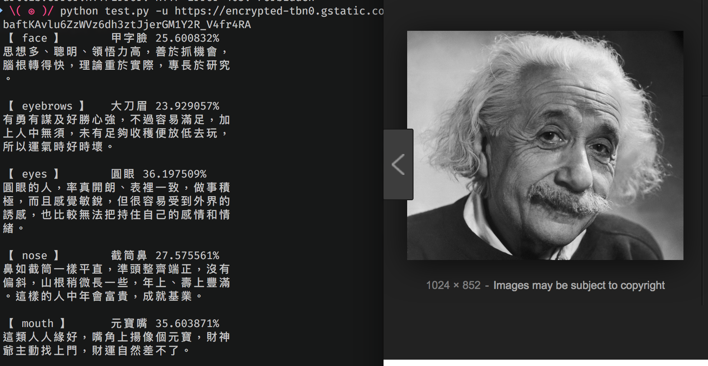

# :man_with_gua_pi_mao: 面相分析 Face reading ( facial feature classification ) 

A physiognomy application which analysis people facial feature to
evaluates a person's characteristic, and then do the fortune-telling. 



_*Only tested in python3_

## Depoly

### Install dependcy

```bash
pip3 install --user -r requirement.txt
```

### Gather data

To build the dataset for training, run `build_db.py`
>Data are collect from Google Image search directly accordling to the facial description mentioned in `data/analysis.json`

```bash
python build_db.py
```

**Or** you may download the builded dataset from [Google Drive](https://drive.google.com/file/d/1Glm-2v-7xdMjOtmyX686G7zxLsHksct5/view?usp=sharing), and extract it into this folder.

### Train

To train your own classifier, run `train.py`  
> If you updated the face database, just delete `data/train_data.pkl` and
> let it generate a new one for you.

```bash
# if need to regenerate the dataset, run below line
# rm data/train_data.pkl
python train.py
```

### Test on image

To run test on different source of image, run `test.py`

```bash
python test.py --help

usage: test.py [-h] [-i IMAGE] [-u URL]

optional arguments:
  -h, --help            show this help message and exit
  -i IMAGE, --image IMAGE
                        input image
  -u URL, --url URL     input image url
```
